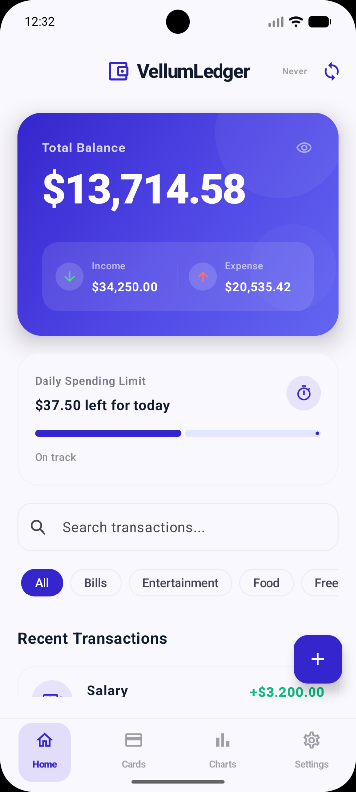
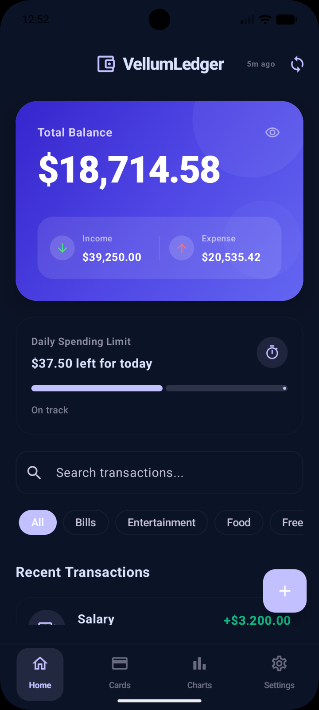
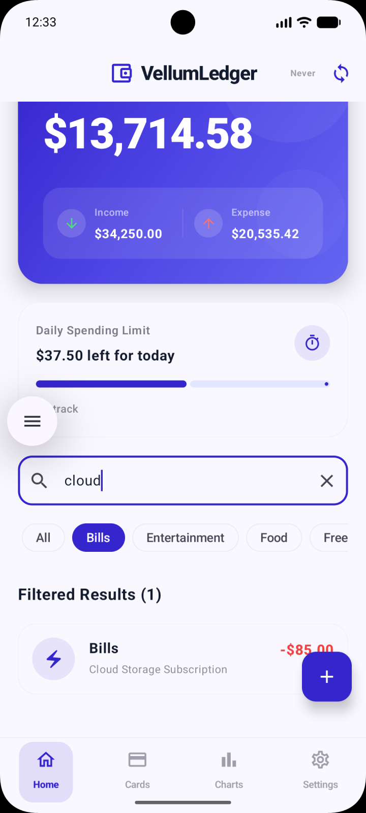
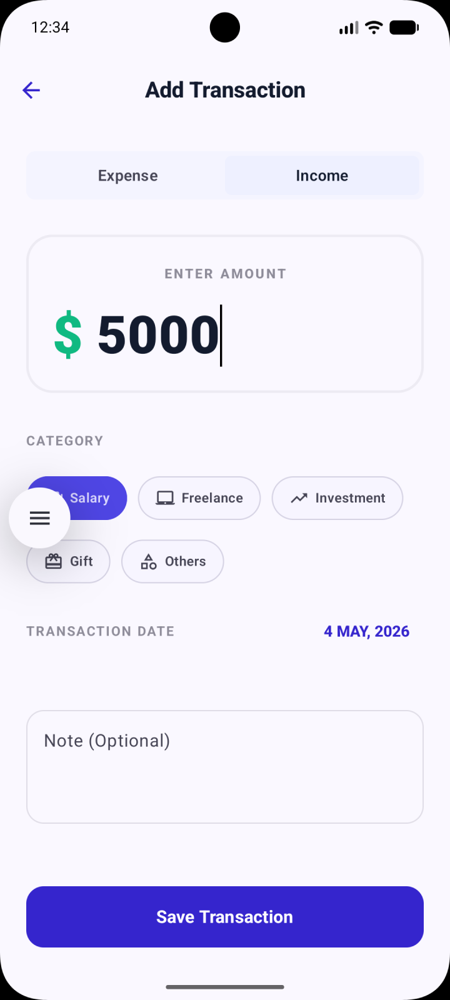
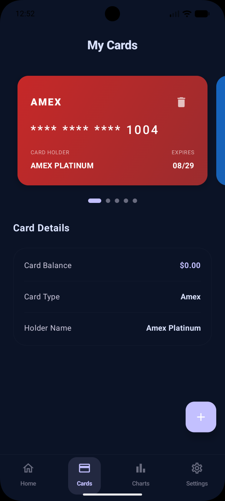
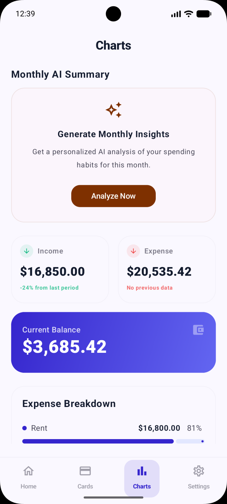
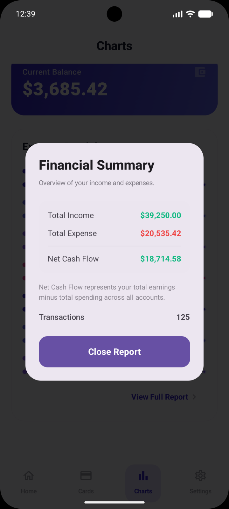

# VellumLedger

> Offline-first personal finance for Android and iOS with a live Ktor sync backend.

A privacy-focused expense tracker built with Kotlin Multiplatform. Every write lands in SQLDelight first. The network is an enhancement, not a dependency. When connectivity returns, a sync queue pushes mutations to a real deployed backend with JWT auth and timestamp-based conflict resolution. On Android, durable background sync is scheduled with WorkManager.

**This is a complete system** mobile client, local database, sync engine, and a production Ktor + PostgreSQL server-> all in Kotlin.

---
## Screenshots

<p align="center">
  
  
  
  
  
</p>
<p align="center">
  
  
  
</p>

---

## Live Backend

The sync server is deployed on Railway and accepting requests:

```bash
# Health check
curl https://vellum-ledger-api-production.up.railway.app/health

# Register (device UUID only; the app sends the same shape)
curl -X POST https://vellum-ledger-api-production.up.railway.app/auth/register \
  -H "Content-Type: application/json" \
  -d '{"deviceId":"<paste-a-stable-uuid>"}'

# Push transactions after sync (replace TOKEN)
curl -X POST https://vellum-ledger-api-production.up.railway.app/transactions/push \
  -H "Authorization: Bearer TOKEN" \
  -H "Content-Type: application/json" \
  -d '{"transactions":[]}'
```

Backend source: [vellum-ledger-api](https://github.com/rudradave1/vellum-ledger-api)-> Ktor · Exposed ORM · PostgreSQL · Railway

---

## Architecture

```
┌─────────────────────────────────────────────────┐
│           Compose Multiplatform UI              │
│     Material 3 · StateFlow · Dark/Light         │
└───────────────────┬─────────────────────────────┘
                    │
┌───────────────────▼─────────────────────────────┐
│              LedgerViewModel                    │
│        StateFlow · Coroutines · MVVM            │
└──────────┬────────────────────────┬─────────────┘
           │                        │
┌──────────▼──────────┐  ┌──────────▼──────────────┐
│  LedgerRepository   │  │      Sync Engine         │
│  Single source      │  │  SyncQueue · SyncWorker  │
│  of truth           │  │  Ktor Client · JWT       │
└──────────┬──────────┘  └──────────┬───────────────┘
           │                        │
┌──────────▼────────────────────────▼───────────────┐
│                 SQLDelight Database               │
│      Transactions · Cards · SyncQueue tables      │
│  expect/actual drivers: Android · iOS (Native)    │
└───────────────────────────────────────────────────┘
                    │ push sync
┌───────────────────▼───────────────────────────────┐
│            Ktor Server (Railway)                  │
│     PostgreSQL · Exposed ORM · JWT Auth           │
│     Conflict resolution: updatedAt wins           │
└───────────────────────────────────────────────────┘
```

---

## How the sync works

Every transaction goes through a strict lifecycle:

```
User action
    → Write to SQLDelight (status: PENDING)
    → SyncQueue enqueues mutation
    → SyncWorker picks up on next cycle
    → POST /transactions/push with JWT
    → Server applies timestamp conflict resolution
    → Status updated: SYNCED or FAILED
    → UI reflects final state via StateFlow
```

**Conflict resolution rule:** `updatedAt` timestamp wins. If the server holds a newer version of a transaction, the push is rejected and the server version is returned on next pull. The mobile app never silently overwrites server state.

**Failure handling:** Failed syncs stay `PENDING` with exponential backoff. The `GlobalErrorHandler` surfaces network and DB errors via Snackbar, and the Home screen shows plain-language `Pending`, `Syncing`, `Synced`, and `Retrying` states.

**Background sync:** Android schedules an immediate and periodic WorkManager job so pending transactions get another chance after app kill or relaunch. iOS relies on the next app run and the persisted sync queue.

---

## Key architectural decisions

**Why SQLDelight over Room?**
Shared schema between Android and iOS in `commonMain`. One set of queries, two platform drivers. Room is Android-only.

**Why a SyncQueue pattern instead of inline sync?**
Writes succeed immediately regardless of network state. The queue decouples the user action from the network call. connectivity is irrelevant to the write path.

**Why Ktor for both client and server?**
Same HTTP library across mobile client and backend. The `NetworkTransaction` DTO contract is defined once and shared. No translation layer between what the client sends and what the server expects.

**Why timestamp-based conflict resolution?**
Simple, auditable, and correct for a single-user finance app. Last write wins by `updatedAt`. The server is the final arbiter. the mobile app never assumes its version is canonical.

---

## Features

| Feature | Status |
|---|---|
| Dashboard -> real-time balance, income, expense | ✅ |
| Add / categorize transactions (income + expense) | ✅ |
| Swipeable card wallet with custom hex color themes | ✅ |
| 7-day spending trend chart | ✅ |
| Category breakdown with percentage analytics | ✅ |
| Weekly / Monthly / Yearly period comparison | ✅ |
| Compact number formatting (K / M / B / T) | ✅ |
| Export transactions to CSV | ✅ |
| Native system share for CSV exports | ✅ |
| Animated sync status indicators per transaction | ✅ |
| Real-time exchange rate engine | ✅ |
| Biometric lock (Android + iOS) | ✅ |
| SQLCipher database encryption | ✅ |
| Dark mode (system-aware) | ✅ |
| JWT authentication with 30-day token expiry | ✅ |
| Live backend -> push sync over HTTPS | ✅ |
| Durable Android background sync | ✅ |
| Crash reporting (Crashlytics) | 🔧 Roadmap |
| iOS TestFlight distribution | 🔧 Roadmap |

---

## Tech stack

| Layer | Technology |
|---|---|
| Mobile language | Kotlin Multiplatform |
| UI | Compose Multiplatform · Material 3 |
| Local database | SQLDelight 2.0 |
| Networking | Ktor Client 2.3 |
| Backend framework | Ktor Server 2.3 |
| Backend ORM | Exposed |
| Backend database | PostgreSQL (Railway) |
| Authentication | JWT (30-day expiry) |
| Encryption | SQLCipher |
| Serialization | Kotlinx Serialization |
| Concurrency | Kotlinx Coroutines · Flow |
| Architecture | MVVM · Repository pattern · Clean layers |

---

## Project structure

```
VellumLedger/
├── composeApp/
│   ├── commonMain/
│   │   ├── sync/           # Ktor client, DTOs, UserSession, SyncWorker
│   │   ├── repository/     # LedgerRepository-> data orchestration
│   │   ├── database/       # SQLDelight schema + LedgerDatabase
│   │   └── ui/             # Screens, ViewModels, theme, error handler
│   ├── androidMain/        # AndroidSqliteDriver, biometric auth
│   └── iosMain/            # NativeSqliteDriver, biometric auth
└── iosApp/                 # SwiftUI shell (thin wrapper)
```

Backend: [github.com/rudradave1/vellum-ledger-api](https://github.com/rudradave1/vellum-ledger-api)

---

## Running locally

**Android**
```bash
./gradlew :composeApp:assembleDebug
```

**iOS**
```bash
open iosApp/iosApp.xcworkspace
```

Requires JDK 17+, Android Studio Hedgehog or newer, Xcode 15+ for iOS.

The app runs fully offline without a backend connection. Sync activates when the server is reachable and a user session exists.

`Clear Local Data` clears only the local SQLDelight database and local queue. It does not delete server-side data. A separate remote-delete flow would be needed if we want a true account/data reset on the backend.

---

## What to look at first

If you're reading this as a code or architecture reference:

- **Sync lifecycle:** `composeApp/commonMain/sync/SyncWorker.kt`
- **Conflict resolution:** `composeApp/commonMain/sync/LedgerApi.kt`
- **Repository as source of truth:** `composeApp/commonMain/repository/LedgerRepository.kt`
- **KMP database boundary:** `composeApp/androidMain/` and `iosMain/`-> platform driver injection
- **Backend push/pull:** [vellum-ledger-api/TransactionRoutes.kt](https://github.com/rudradave1/vellum-ledger-api)

---

MIT License
